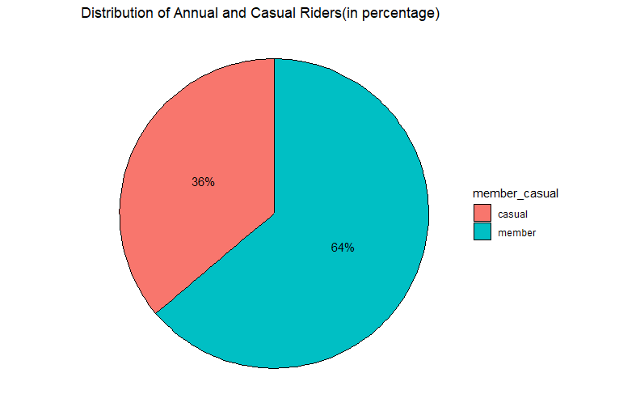
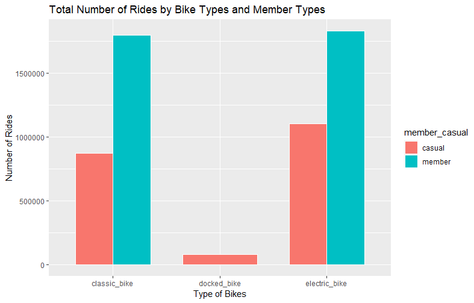
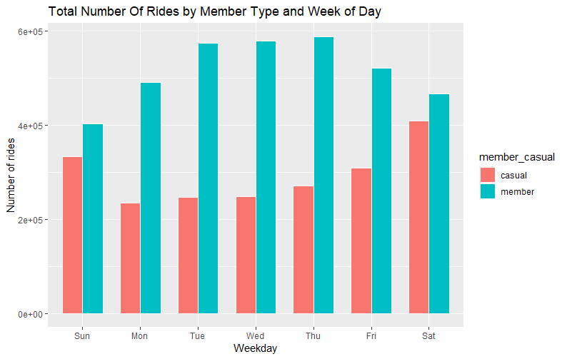
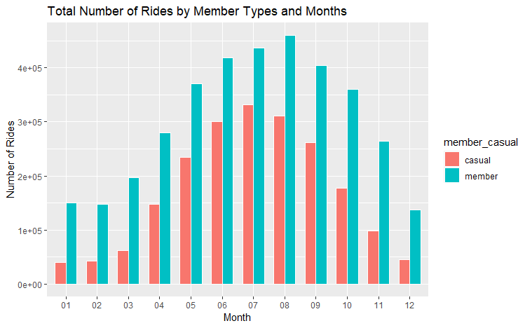
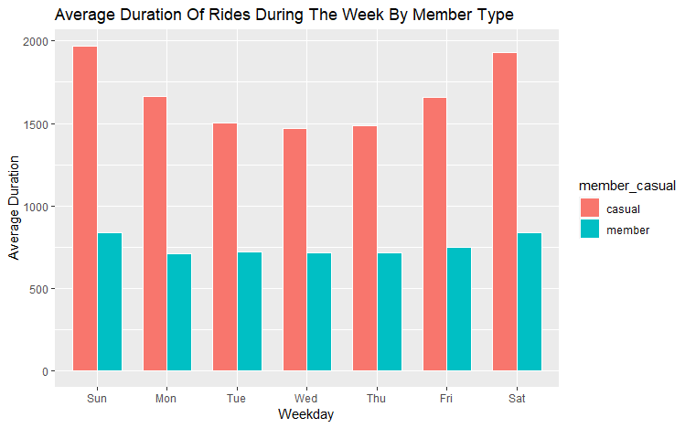

# Background

In 2016, Cyclistic launched a successful bike-share offering. Since
then, the program has grown to a fleet of 5,824 bicycles that are
geotracked and locked into a network of 692 stations across Chicago. The
bikes can be unlocked from one station and returned to any other station
in the system anytime.

## Ask

**Business Question:**

How do annual members and casual riders use Cyclistic bikes differently?

**Key Stackholder:**

- Lily Moreno (Director Of Marketing)
- Cyclistic Marketing Analytics Team
- Cyclistic Executive Team

## Prepare

The data contains information about Cyclistic’s historical trip &
customer bike usage pattern. The data is obtained from December 2022 to
November 2023(12 Months of data).

Data Source: [link](https://divvy-tripdata.s3.amazonaws.com/index.html)

## Process

R Studio will be used as Data Cleaning, Manipulation and Vizualization
tool.

**Data Preparation:**

- Library used: Tidyverse, Lubricate.
- Import the data from December 2022 to November 2023.
- Check the column names of the imported data.
- Merge the data into single dataframe.

**Data Cleaning**

- Remove start_lat, start_lng, end_lat and end_lng columns from
  dataframes since these are not needed for current analysis.
- Create additional column for day, month, year, date and day of week
  for further data analysis.
- Create column ride_length by calculating difference between started_at
  and ended_at column using `difftime()` function.
- Converted ride_length column into numeric datatype.
- Removed and filtered data that contains zero or negative value in
  ride_length column.
- Ordered the day of week column.

## Analyze

In this phase, We will explore the question “how do annual members
differ from casual riders” by performing statical analysis on the
cleaned data.

**Descriptive Analysis**

- Calculated the mean, median, maximum and minimum of ride length
  column.

**Data Aggregation**

- Count the total number of each bike type using `table()` function.
- Count the total number of each bike type for both annual member casual
  rider type.
- Calculated the total number of types of members in the data.
- Calculated total number of rides during both weekdays and month.
- Calculated the total number of types of members taking rides based on
  both weekdays and month.
- Calculated mean, median, maximum and minimum for both the member type
  and compared them using `aggregate()` function.
- Calculated the average duration of ride length of both member and
  casual ride.

## Share

After analysing the data, I visualized the data using charts to make a
comparision between annual members and casual riders.

***Visual 1: Distribution of annual members and Casual riders.***

<!-- -->

The Above pie charts tells us that there are more annual members than
casual riders

***Visual 2: Number of Rides by Bike Types and Member Types.***

<!-- -->

From the above visualization, We can see that classic bikes and electric
bikes are more popular among annual members and casual riders. Electric
bikes usage is higher than classic bikes. Furthermore, docked bikes are
used way less by casual riders only and are not used by annual members.

***Visual 3: Number of Rides by Member Type and Day of Week.***

<!-- -->

The usage of bikes for casual users is lowest during week days and
highest for annual members, But during weekends the usages of bikes for
casual riders increases.

***Visual 4: Number of Rides by Member Type and Week of the Day.***

<!-- -->

The usage of bikes fall during beginning and end of the
year(i.e. Jan-Feb and Nov-Dec) and there is high usage during summer and
fall(i.e. Mar-Oct).

**\_ Visual 5: Average Duration for Member Types.\_**

<!-- -->

The above graph tell us that the average ride length is higher for
casual rider than the annual members.

## Act

**Conclusion**

After performing analysis and creating visualization of the data, I
found that there are large percentage of annual members compared to
casual riders, higher usage of electric bikes, popularity of usage of
bike during summer and fall(i.e. March-October) and average ride length
time is higher for casual riders. The least popular bike is docked bike
only used by casual riders.

**Recommendations**

- As casual riders spend more time riding bikes and having higher usage
  of electric bike than for docked or classic bikes, it would be great
  idea to provide discounts on the classic and docked bikes.
- As the popularity of bike usage is high throughout March to October,
  it would be good to start some campaigns to maintain or increase bike
  usage during that time of year.
- Launch advertisement to convert casual riders to annual members
  through emails, messages etc.
